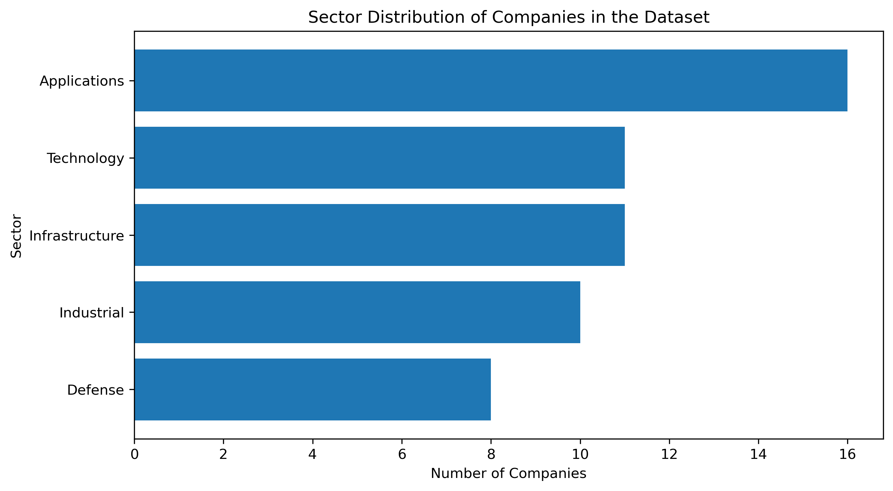
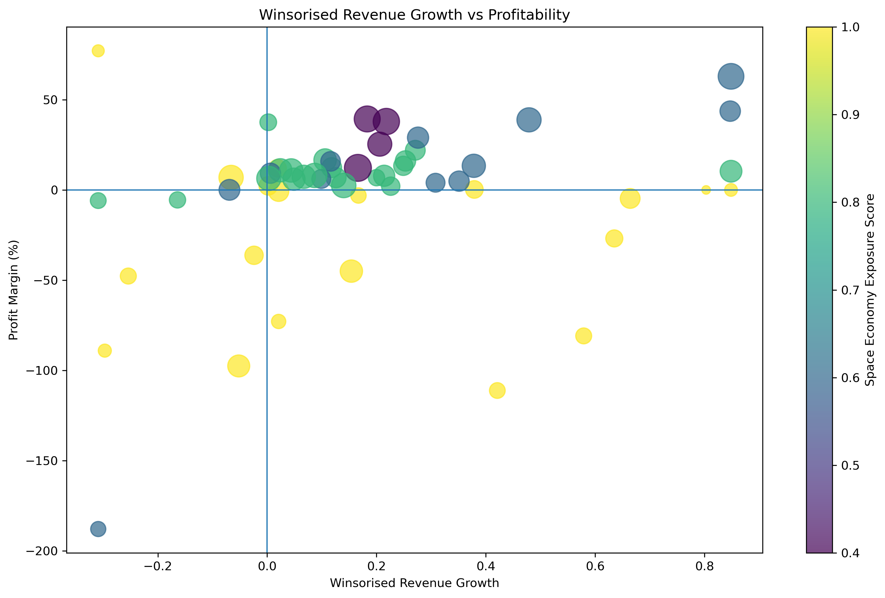
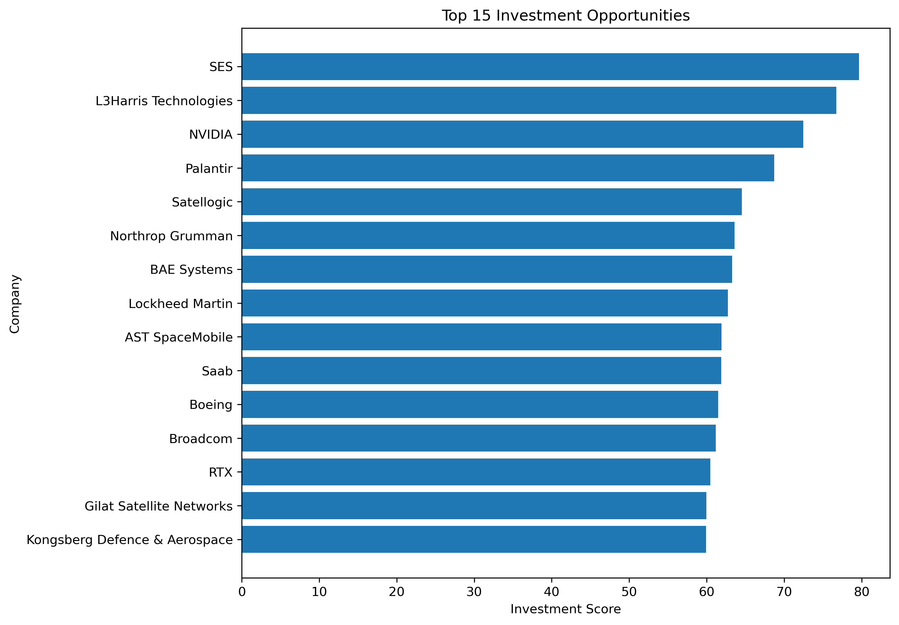

# 🚀 Investment Opportunities in the Global Space Economy

A data-driven investment analysis project that combines SQL, Python and financial data to identify attractive publicly listed companies across the global space economy.

This project builds a multi-factor investment scoring model by combining financial performance with industry positioning rather than relying on a single valuation metric.

---

## Project Overview

The global space economy extends far beyond launch providers and satellite operators. It includes semiconductor manufacturers, aerospace companies, cloud computing providers, Earth observation businesses and defence contractors that support the expanding space ecosystem.

This project evaluates listed companies using six complementary investment factors and produces an overall Investment Score for ranking opportunities.

---

## Dataset

The project contains **83 companies** spanning multiple sectors of the global space economy, including:

- Infrastructure
- Applications
- Technology
- Industrial
- Defense

Financial information was collected using the **Yahoo Finance API (yfinance)** and stored in a local SQLite database.

---

## Technologies

- Python
- SQL (SQLite)
- Pandas
- NumPy
- Matplotlib
- yfinance
- Jupyter Notebook

---

## Project Structure

```
Space-Economy-Analysis/
│
├── data/
│   └── space_economy.db
│
├── images/
│   ├── sector_distribution.png
│   ├── growth_profitability.png
│   └── top15.png
│
├── notebooks/
│   ├── 01_build_database.ipynb
│   ├── 02_data_cleaning.ipynb
│   ├── 03_financial_analysis.ipynb
│   └── 04_Investment_Opportunities_in_the_Space_Economy.ipynb
│
└── README.md
```

---

## Methodology

The final Investment Score combines six factors.

| Factor | Transformation | Weight |
|---|---|---:|
| Space Economy Exposure | Rule-based subsector score divided by 5 | 10% |
| Company Size | Log-transformed revenue, then Min-Max normalised | 8% |
| Revenue Growth | Winsorised at 5th/95th percentiles | 32% |
| Profitability | Profit margin | 25% |
| Valuation | Winsorised and inverse-transformed Price-to-Sales ratio | 15% |
| Market Risk | Reverse-normalised beta | 10% |

All factors are normalised to a common 0–1 scale before being combined into the final weighted score.

---

## Results

### Sector Distribution



The dataset covers companies from five major sectors across the global space economy.

---

### Revenue Growth vs Profitability



This chart illustrates the relationship between revenue growth and profitability.

- x-axis: Winsorised revenue growth
- y-axis: Profit margin
- Bubble size: Company revenue
- Colour: Space Economy Exposure Score

The visualisation highlights companies that combine strong financial performance with meaningful exposure to the space economy.

---

### Top 15 Investment Opportunities



The final ranking combines all six investment factors into a single Investment Score.

Rather than selecting companies solely based on size or growth, the model rewards businesses with balanced financial quality and strong strategic positioning within the global space economy.

---

## Data Source and Snapshot

Company and market data were collected using the `yfinance` Python package.

The database represents a point-in-time snapshot collected in **July 2026**.

Because financial markets continuously evolve, rerunning the data collection notebook may produce different financial metrics and rankings.

---

## Key Findings

- Defence and aerospace companies consistently achieve high scores due to strong profitability and high exposure to the space economy.
- Large technology companies such as Microsoft, NVIDIA and Alphabet benefit from strong financial performance despite lower direct exposure.
- Combining multiple financial indicators produces a more balanced ranking than relying on any single metric.

---

## Model Limitations

- Space Economy Exposure is a rule-based proxy rather than a measured percentage of space-related revenue.
- The model uses point-in-time financial data rather than multi-year averages.
- Companies with incomplete financial metrics are excluded from the final ranking.
- Beta measures market sensitivity and does not capture every aspect of investment risk.
- Final rankings are sensitive to factor definitions and weighting choices.

---

## Future Improvements

Potential future enhancements include:

- Free cash flow analysis
- Debt and leverage ratios
- Historical volatility
- Analyst estimates
- Multi-year financial trends
- Alternative weighting methods
- Machine learning based ranking models

---

## Author

**Binyu Xie**

Imperial College London  
BSc Mathematics